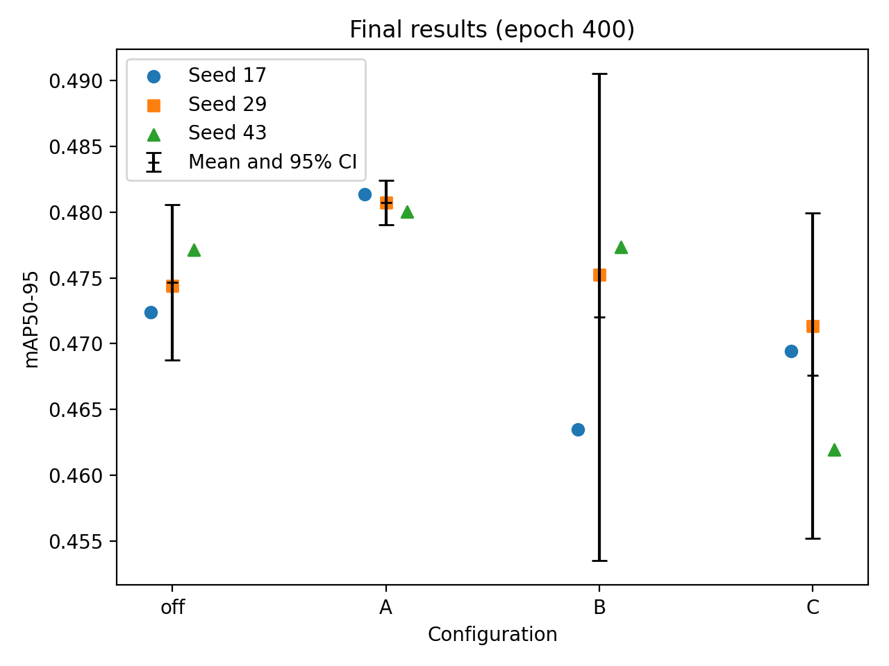
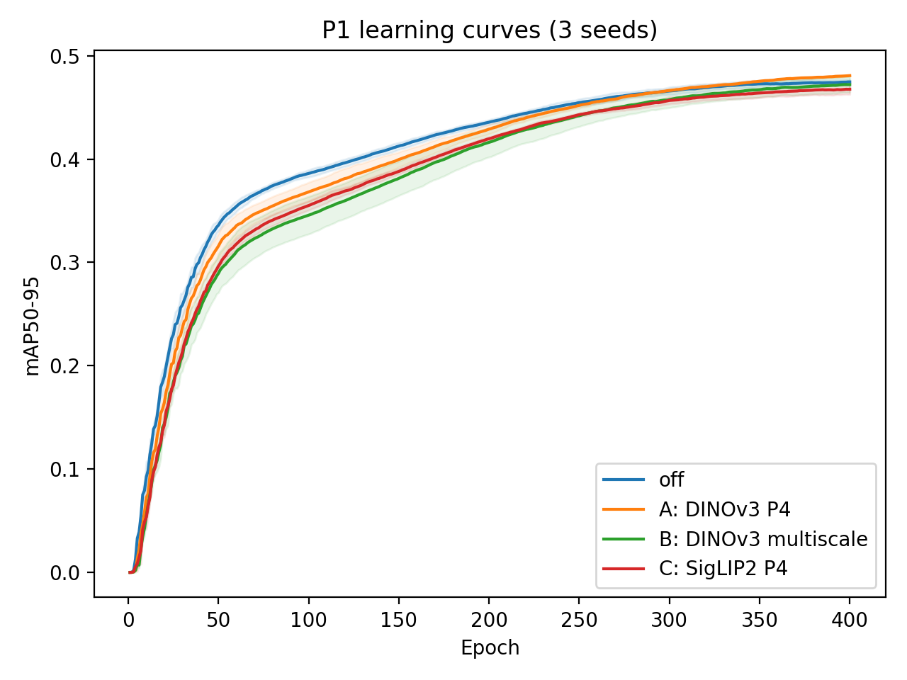
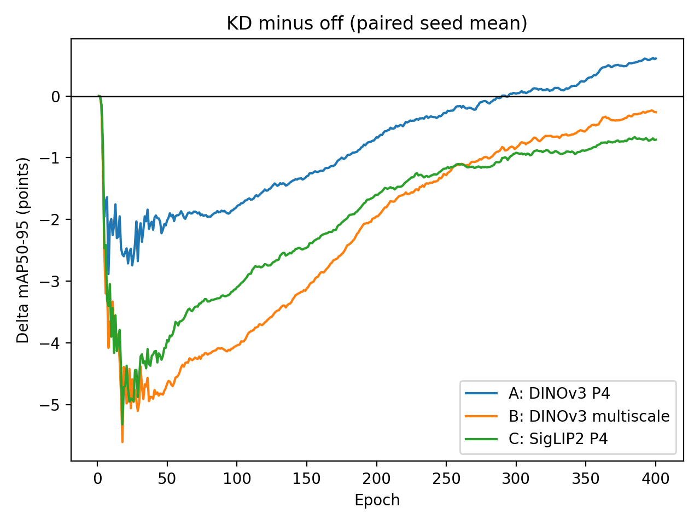

# D2 P1 实验总结：Foundation 特征蒸馏对 YOLO-Master 的影响

## 结论摘要

P1 已达到验收要求：完成了 Foundation 蒸馏开关的同预算对照，并在“教师模型 × 蒸馏尺度”的 2×2 矩阵中完成 A、B、C 三格；每个实验均运行 `17`、`29`、`43` 三个随机种子。D 格按“2×2 中至少完成 3 格”的要求主动跳过，不属于实验缺失。

实验结果支持将 **DINOv3 + P4 单尺度蒸馏（A）** 作为唯一候选路线继续验证，但当前证据只能判为**条件 go**，不能宣称稳定涨点：A 相对同 seed baseline 的平均提升为 `+0.608 mAP`，三个 seed 均为正，但 95% 置信区间仍包含 0。

- B（DINOv3 + multiscale）平均下降 `-0.262 mAP`，绝对差值小于 0.3 且置信区间包含 0，命中预设 no-go 条件。
- C（SigLIP2 + P4）平均下降 `-0.707 mAP`，当前结果不支持继续投入。
- KD 路线在训练前中期总体落后于 off；只有 A 的三 seed 平均曲线在训练后期持续反超，B、C 的最终平均差值仍为负。
- 多尺度没有优于 P4 单尺度；现阶段不建议补跑 D，也不建议把 P2 扩展到所有组合。

## P1 验收范围

P1 的核心问题是：在训练预算和其他变量保持一致时，冻结的 Foundation 教师特征能否改善小型 YOLO-Master backbone。

| 实验格 | 教师 | 蒸馏位置 | 主要用途 | 完成情况 |
|---|---|---|---|---|
| off | 无 | 无 | 共享的 KD-off 对照组 | 3 seeds 完成 |
| A | DINOv3 | P4 | DINOv3 P4 相对 off 的主效应 | 3 seeds 完成 |
| B | DINOv3 | P3+P4+P5 | 与 A 比较蒸馏尺度 | 3 seeds 完成 |
| C | SigLIP2 | P4 | 与 A 比较教师模型 | 3 seeds 完成 |
| D | SigLIP2 | P3+P4+P5 | 教师与尺度的交互格 | 按要求跳过 |

D 同时改变教师模型和蒸馏尺度，不能单独提供干净的教师主效应或尺度主效应。已完成的 A、B、C 三格能够分别回答主路线、尺度和教师选择问题，因此优先停止 D，可以把后续预算集中到更有信息量的验证上。

## 实验可信度与证据

所有已收集实验的 resolved args 无混杂检查均通过。各组除声明的教师、蒸馏层级和 KD 开关外，训练预算与关键配置保持一致；每个 treatment 均与相同 seed 的 off 组配对比较。

证据位置：

- 汇总表：`experiments/d2/results/p1voc_summary.md`
- baseline：`experiments/d2/results/p1voc_off-s17/`、`p1voc_off-s29/`、`p1voc_off-s43/`
- A：`experiments/d2/results/p1voc_a-s17/`、`p1voc_a-s29/`、`p1voc_a-s43/`
- B：`experiments/d2/results/p1voc_b-s17/`、`p1voc_b-s29/`、`p1voc_b-s43/`
- C：`experiments/d2/results/p1voc_c-s17/`、`p1voc_c-s29/`、`p1voc_c-s43/`

## 最终精度

下表指标为 epoch 400 的 `metrics/mAP50-95(B)`。数值使用 Ultralytics 的 0–1 标度；例如 `0.00608` 等于 `0.608 mAP` 点。

本次从当前 run 目录重新归档全部 12 组结果；与上一版相比，A/B 的 seed 17、29 数据更新，其余 8 组未变化。统计口径及预设阈值保持一致。

| 实验格 | seed 17 | seed 29 | seed 43 | 均值 | 标准差 |
|---|---:|---:|---:|---:|---:|
| off | 0.47239 | 0.47440 | 0.47713 | 0.47464 | 0.00238 |
| A：DINOv3 P4 | 0.48138 | 0.48075 | 0.48003 | **0.48072** | 0.00068 |
| B：DINOv3 multiscale | 0.46349 | 0.47524 | 0.47733 | 0.47202 | 0.00746 |
| C：SigLIP2 P4 | 0.46943 | 0.47135 | 0.46192 | 0.46757 | 0.00498 |

## 与 baseline 的配对效应

每个 treatment 都减去相同 seed 的 off 结果。95% CI 使用三个配对差值计算的双侧 t 区间；由于 `n=3`，区间较宽，应避免过度解释显著性。

| 对照 | 各 seed 的 ΔmAP50-95 | 平均 Δ（0–1 标度） | 平均 Δ（mAP 点） | 95% CI（0–1 标度） |
|---|---|---:|---:|---|
| A - off | +0.00899, +0.00635, +0.00290 | +0.00608 | **+0.608** | [-0.00151, +0.01367] |
| B - off | -0.00890, +0.00084, +0.00020 | -0.00262 | -0.262 | [-0.01615, +0.01091] |
| C - off | -0.00296, -0.00305, -0.01521 | -0.00707 | **-0.707** | [-0.02458, +0.01043] |



*图 1：epoch 400 的三个 seed 原始结果，黑色标记及误差线为各组均值及双侧 t 分布 95% CI（自由度 2）。这里的区间是各组绝对 mAP 均值的区间；go/no-go 仍依据上表的配对差值区间，不能由本图误差线是否重叠来判断。*

预先设定的判读线为：

```text
|ΔmAP| < 0.3 mAP 点，并且 95% CI 包含 0 => no-go
```

等价到本表使用的 0–1 标度为 `|ΔmAP50-95| < 0.003` 且 95% CI 包含 0。

## 两条实验轴的发现

| 比较 | 回答的问题 | 平均差值 | 95% CI | 解释 |
|---|---|---:|---|---|
| A - C | 同为 P4 时，DINOv3 是否优于 SigLIP2 | +0.01315 | [+0.00203, +0.02428] | 三个 seed 均偏向 DINOv3，未校正的配对 95% CI 不含 0 |
| A - B | DINOv3 下，P4 是否优于 multiscale | +0.00870 | [-0.01138, +0.02878] | 三个 seed 均偏向 P4，但 CI 跨 0，尺度效应仍不确定 |

两条轴的数值均使用 0–1 标度。A − C 的区间不含 0，但仅有三个 seed，且未做多重比较校正；这也不等于 A 相对 off 的提升已经确定。

### A：DINOv3 P4

A 是 P1 中最强、也最一致的信号。三个 seed 均优于对应 baseline，平均提升超过 `0.3 mAP` 的实用阈值，且 treatment 自身方差低于 baseline。不过其 95% CI 仍跨 0，因此只能说明“值得继续验证”，不能说明提升已经统计确定。

### B：DINOv3 multiscale

B 的平均差值为 `-0.262 mAP`，绝对值低于预设阈值且 95% CI 包含 0，因此按预设规则判为 no-go。seed 17 下降 `0.890 mAP`，seed 29、43 分别略升 `0.084`、`0.020 mAP`；B 的 seed 间波动明显增大，三个 seed 均低于 A。由于 `imgsz=256` 时 P3/P5 对齐需要插值，本实验暂时不能完全区分“多尺度本身无益”和“插值削弱了蒸馏信号”，但这不影响当前停止该路线的资源决策。

### C：SigLIP2 P4

C 的三个 seed 均未超过对应 baseline，平均下降 `0.707 mAP`，且 seed 43 的下降明显更大。虽然样本量不足以给出稳定的区间结论，但现有结果没有支持 SigLIP2 P4 的正向证据，应判为停止。

## 训练动态：KD 收益只在后期出现

除了最终 mAP，训练曲线还显示出一致的优化现象：**所有 KD 配置在训练前期和中期都明显落后于 off，只有在 baseline mAP 接近稳定后，部分 KD 路线才开始反超。** 下表为各 epoch 上 treatment 相对同 seed off 的平均差值，均为三个 seed 的均值。



*图 2：逐 epoch 的三 seed 平均 mAP，阴影为 ±1 样本标准差，不是置信区间；未进行移动平均平滑。*



*图 3：先按相同 seed 计算 KD − off，再取三个 seed 的均值；单位为 mAP 点，黑色水平线表示零差值。未进行平滑。*

图表可在安装了 matplotlib、numpy 的环境中运行 `python experiments/d2/scripts/plot_p1_findings.py` 重新生成。

| Epoch | A - off | B - off | C - off |
|---:|---:|---:|---:|
| 50 | -0.0202 | -0.0466 | -0.0395 |
| 100 | -0.0179 | -0.0404 | -0.0310 |
| 200 | -0.0067 | -0.0195 | -0.0160 |
| 300 | +0.0004 | -0.0084 | -0.0092 |
| 325 | +0.0009 | -0.0065 | -0.0092 |
| 350 | +0.0025 | -0.0056 | -0.0088 |
| 375 | +0.0049 | -0.0038 | -0.0073 |
| 400 | **+0.0061** | **-0.0026** | **-0.0071** |

从逐 epoch 的三 seed 平均曲线看，A 从 epoch 295 起持续高于 off，直到 epoch 400。B、C 的平均曲线没有持续至训练结束的反超，最终均低于 off。这里的“持续反超”定义为该 epoch 起至最后一轮的所有平均差值均大于 0；不代表每个 seed 同时反超。“接近稳定”仅是曲线趋势描述，没有另设定量收敛判据。

这一现象带来三个发现：

1. KD 在当前配置下会减慢学生模型的早期任务拟合，蒸馏约束与检测目标在训练前期可能存在优化竞争。
2. A 的最终正收益出现在训练后期；如果只跑短周期实验，可能会把它误判为负结果。更新后的 B 不再支持“最终正收益”的结论。
3. 晚期反超并非所有 KD 都会发生。B、C 的最终平均结果仍低于 off。是否存在教师表征不匹配、以及延长训练是否有帮助，当前实验尚不能确定。

因此，后续复现实验应保留完整训练预算，并同时报告学习曲线和最终指标。若要验证原因，可在不改变主判读线的前提下，比较 KD warm-up、后期启用 KD 或较低早期 KD 权重；这些属于 P2 优化诊断，不应回头修改 P1 的既定对照。

## Go/No-go 建议

| 路线 | 判定 | 建议 |
|---|---|---|
| A：DINOv3 P4 | **条件 go** | 进入下一步验证，但结论表述为方向性正收益 |
| B：DINOv3 multiscale | **no-go** | 不进入 P2；保留为多尺度负结果 |
| C：SigLIP2 P4 | **no-go** | 不进入 P2；记录教师选择负结果 |
| D：SigLIP2 multiscale | **不运行** | 除非后续明确需要交互分析，否则不补跑 |

## 下一步

1. 将 P2 范围收敛到 A（DINOv3 P4），分析受益类别和目标尺度。
2. 若需要对外声称精度提升，继续为 off 和 A 增加配对 seeds；不要修改已设定的 `0.3 mAP` 判读线。
3. 检查 A 的类别级 AP、small/medium/large AP 与训练曲线，确认平均收益不是由少数类别或偶然 checkpoint 主导。
4. 针对 KD 前期落后的现象，优先对 A 做 KD warm-up 或分阶段权重诊断，判断是否能减少早期优化竞争。
5. 在正式建议书中同时保留 B、C 的负结果、`n=3` 的统计限制，以及 multiscale 插值这一潜在原因。

## 最终结论

P1 表明，Foundation 特征蒸馏并非对所有教师和尺度组合都有效，而且其可能收益主要出现在训练后期。当前只有 DINOv3 P4 显示一致的最终正向信号，适合以条件 go 进入 P2；DINOv3 multiscale 收益不足，SigLIP2 P4 为负向结果。该结论满足“允许负结果、以设计依据、对照质量和 go/no-go 判断为验收核心”的要求，但仍需更多 seed、类别/尺度分析及早期优化竞争诊断，才能形成更强的精度主张。
